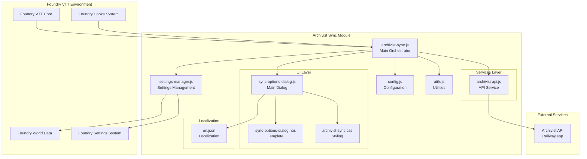
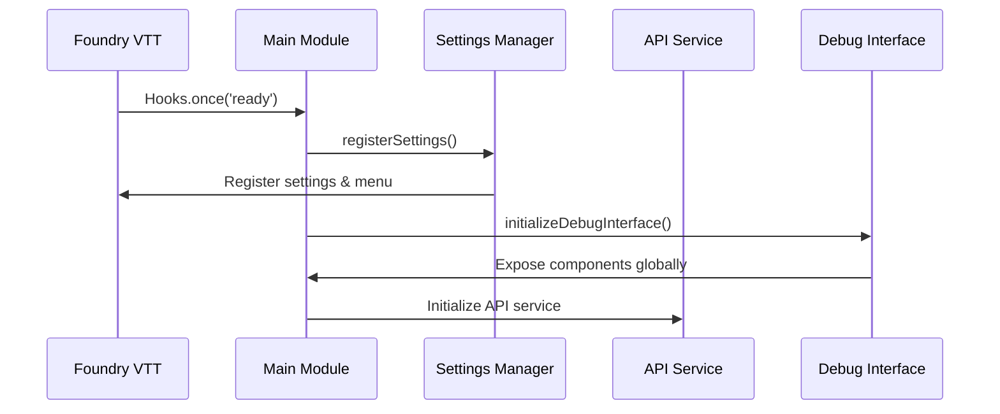
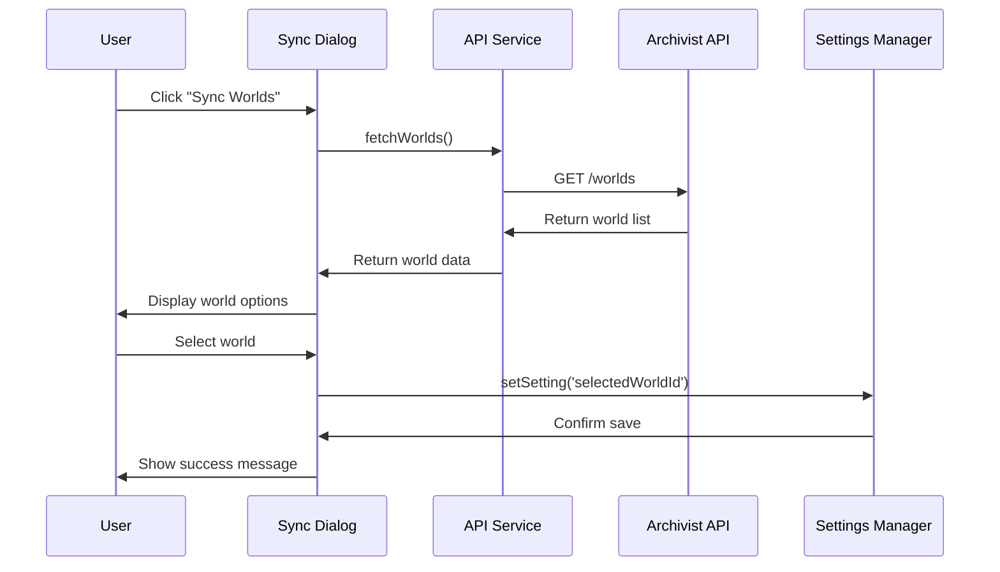
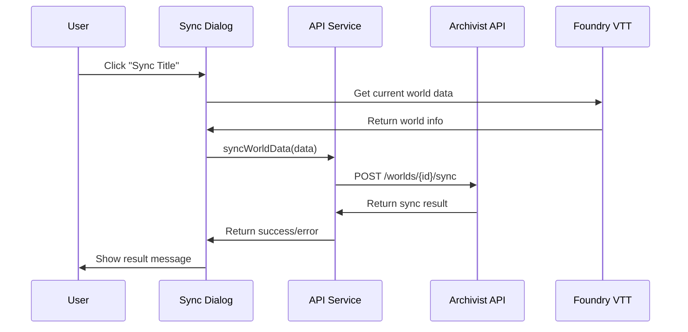
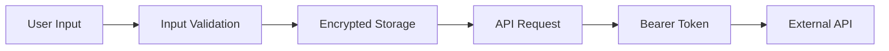
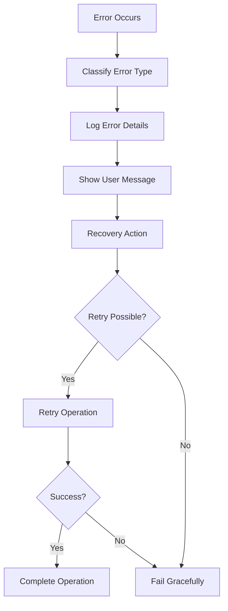

# Architecture Documentation

## System Overview

The Archivist Sync module is a Foundry VTT integration that provides bidirectional synchronization between Foundry VTT worlds and the Archivist API service. The architecture follows a modular, service-oriented design pattern optimized for Foundry VTT's ecosystem.

## High-Level Architecture



## Component Architecture

### 1. Main Orchestrator (`archivist-sync.js`)

**Responsibility**: Module lifecycle management and component coordination

**Key Functions**:
- Module initialization via Foundry hooks
- Global component registration
- Debug interface setup
- Component export for external access

**Dependencies**:
- All module components
- Foundry VTT hooks system

**Exports**:
```javascript
export {
  CONFIG,           // Configuration constants
  settingsManager,  // Settings management
  archivistApi,     // API service
  Utils,           // Utility functions
  SyncOptionsDialog // Main dialog
}
```

### 2. Configuration Layer (`config.js`)

**Responsibility**: Centralized configuration management

**Structure**:
```javascript
export const CONFIG = {
  MODULE_ID: 'archivist-sync',
  MODULE_TITLE: 'Archivist Sync',
  API_BASE_URL: 'https://archivist-api-production.up.railway.app/v1'
};

export const SETTINGS = {
  // Foundry settings definitions
  API_KEY: { /* ... */ },
  SELECTED_WORLD_ID: { /* ... */ },
  SELECTED_WORLD_NAME: { /* ... */ }
};

export const MENU_CONFIG = {
  // Menu item configurations
};

export const DIALOG_CONFIG = {
  // Dialog configurations
};

export const TABS = {
  // Tab identifiers
};
```

**Design Patterns**:
- Constants as configuration
- Structured settings definitions
- Separation of concerns

### 3. Settings Management (`settings-manager.js`)

**Responsibility**: Foundry VTT settings integration and persistence

**Key Features**:
- Settings registration with Foundry
- Encrypted storage for sensitive data
- Menu item registration
- GM-only access control

**Security Model**:
- World-scoped settings
- Encrypted API key storage
- Permission-based access control

**API**:
```javascript
class SettingsManager {
  registerSettings()     // Register all settings with Foundry
  getSetting(key)        // Retrieve setting value
  setSetting(key, value) // Set setting value
  registerMenu()         // Register menu items
}
```

### 4. API Service (`archivist-api.js`)

**Responsibility**: External API communication and data synchronization

**Architecture**:
```javascript
class ArchivistApi {
  // Core API methods
  async fetchWorlds()           // Fetch available worlds
  async fetchWorldData(worldId) // Fetch specific world data
  async syncWorldData(data)     // Sync world data
  
  // Utility methods
  getApiStatus()               // Check API connectivity
  validateApiKey()             // Validate API key
  handleApiError(error)        // Error handling
}
```

**Communication Flow**:
1. Authentication via Bearer token
2. Request/response handling
3. Error management and user feedback
4. Status reporting

**Error Handling**:
- Network timeout handling
- HTTP status code interpretation
- User-friendly error messages
- Retry logic for transient failures

### 5. User Interface Layer

#### Main Dialog (`sync-options-dialog.js`)

**Responsibility**: Primary user interface for module interaction

**Architecture**:
```javascript
class SyncOptionsDialog extends Application {
  // Lifecycle methods
  static get defaultOptions()  // Dialog configuration
  getData()                    // Template data preparation
  activateListeners()          // Event handling
  
  // Tab management
  _onTabChange(event)          // Tab switching
  _renderTab(tabName)          // Tab rendering
  
  // API integration
  _onSyncWorlds()              // World synchronization
  _onSaveSelection()           // Save world selection
  _onSyncTitle()               // Title synchronization
  _onSyncCharacters()          // Character synchronization
}
```

**UI Structure**:
- Tabbed interface (World, Title, Characters)
- Real-time status indicators
- Form controls and validation
- Progress indicators

#### Template System (`sync-options-dialog.hbs`)

**Responsibility**: HTML structure and data binding

**Features**:
- Handlebars templating
- Conditional rendering
- Data binding
- Accessibility support

### 6. Utility Layer (`utils.js`)

**Responsibility**: Common functionality and helper functions

**Key Functions**:
```javascript
class Utils {
  // Logging
  static log(message, ...args)     // Consistent logging
  static warn(message, ...args)    // Warning messages
  static error(message, ...args)   // Error messages
  
  // Data validation
  static validateApiKey(key)       // API key validation
  static validateWorldData(data)   // World data validation
  
  // Foundry integration
  static getCurrentWorld()         // Get current Foundry world
  static getActorsByType(type)     // Get actors by type
  static formatTimestamp(date)     // Date formatting
}
```

## Data Flow Architecture

### 1. Module Initialization Flow



### 2. World Synchronization Flow



### 3. Data Synchronization Flow



## Security Architecture

### 1. Authentication Flow



### 2. Permission Model

- **GM-Only Access**: All module functionality restricted to Game Masters
- **World-Scoped Settings**: Settings isolated per Foundry world
- **Encrypted Storage**: API keys stored with Foundry's encryption
- **Input Validation**: All user inputs validated and sanitized

### 3. API Security

- **HTTPS Only**: All API communication over secure connections
- **Bearer Token Authentication**: Standard OAuth2-style authentication
- **Request Validation**: All API requests validated before sending
- **Error Handling**: Secure error messages without sensitive data exposure

## Error Handling Architecture

### 1. Error Classification

```javascript
// Error types and handling strategies
const ERROR_TYPES = {
  NETWORK: 'Network connectivity issues',
  AUTHENTICATION: 'API key or authentication problems',
  VALIDATION: 'Input validation failures',
  API: 'External API errors',
  FOUNDRY: 'Foundry VTT integration errors'
};
```

### 2. Error Handling Flow



## Performance Considerations

### 1. Lazy Loading
- Components loaded only when needed
- API calls made on-demand
- Dialog rendering optimized for performance

### 2. Caching Strategy
- World data cached during session
- API status cached with TTL
- Settings cached in memory

### 3. Memory Management
- Proper cleanup of event listeners
- Dialog disposal when closed
- Minimal global state

## Extension Points

### 1. Adding New API Endpoints
- Extend `ArchivistApi` class
- Add new methods following existing patterns
- Update error handling and validation

### 2. Adding New UI Components
- Create new dialog classes extending `Application`
- Add corresponding Handlebars templates
- Register with main module

### 3. Adding New Settings
- Define in `config.js` SETTINGS object
- Register in `settings-manager.js`
- Add localization strings

### 4. Adding New Features
- Follow modular architecture patterns
- Maintain separation of concerns
- Update configuration and documentation

## Testing Architecture

### 1. Unit Testing
- Individual component testing
- Mock Foundry VTT environment
- API service testing with mock responses

### 2. Integration Testing
- Full module integration
- API communication testing
- UI interaction testing

### 3. End-to-End Testing
- Complete user workflows
- Foundry VTT environment testing
- Real API integration testing

This architecture provides a solid foundation for the Archivist Sync module while maintaining flexibility for future enhancements and extensions.